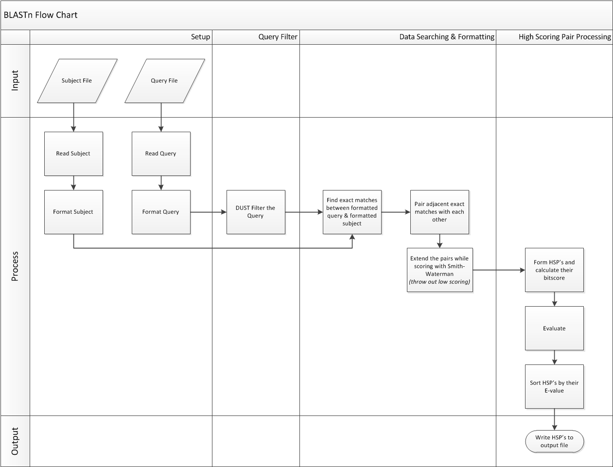

# Blastn
An implementation of the basic local alignment search tool (Blast) for nucleotides. The goal of this project is to implement the Blastn algorithm in C++ and interop with an FPGA implementation of the Smith-Waterman algorithm to greatly accelerate the word extension stage of Blastn.

## Process


## Cloning
```
# HTTPS
$ git clone https://github.com/JacobLondon/Blastn.git --recurse-submodules

# SSH
$ git clone git@github.com:/JacobLondon/Blastn.git --recurse-submodules
```

## Building and Running
### Docker
Run `docker build -t blastn .` to create the environment with all necessary dependencies. Blastn will be placed under `/root`.
### C++
See the [C++ README.md](cpp/README.md)

## Dependencies
* Python
  * python 3.6+
  * pip3
  * numpy
  * tqdm
* C++
  * c++17
  * g++ 7.4+
  * GNU Make 4.2.1+

## Members
Electrical and Computer Engineering Senior Project at California State Polytechnic University, Pomona
- Alden Param
- Alex Chan
- Hmayak Apetyan
- Jacob London
- Simon Tutak
- Sivaramakrishnan Prabakar

## Advisors
- Mohamed El-Hadedy (Mohamed Aly)
- Mostafa M. Hashim Ellabaan
